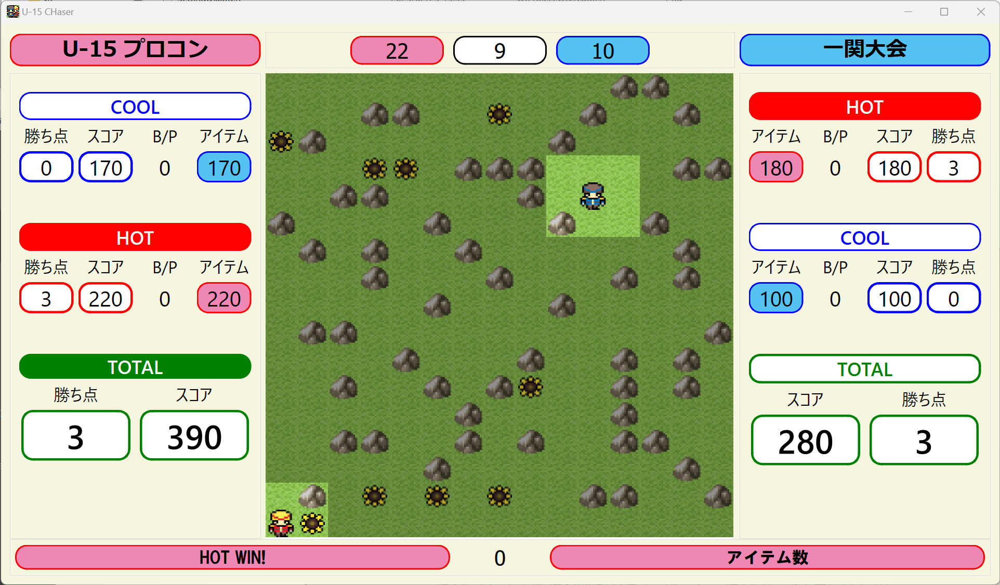
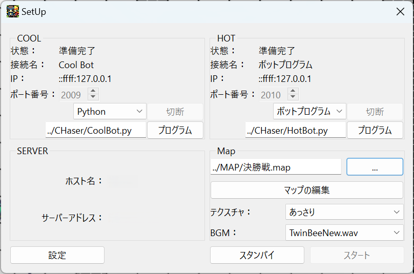
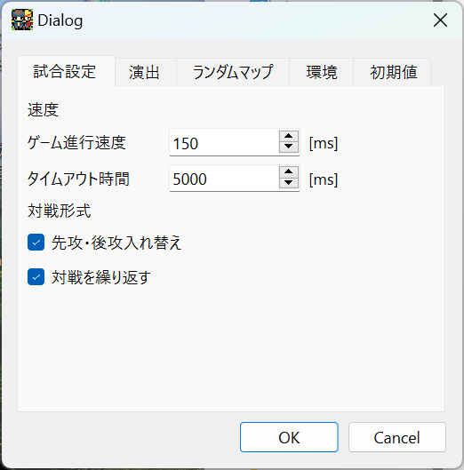
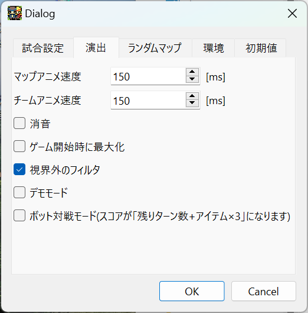
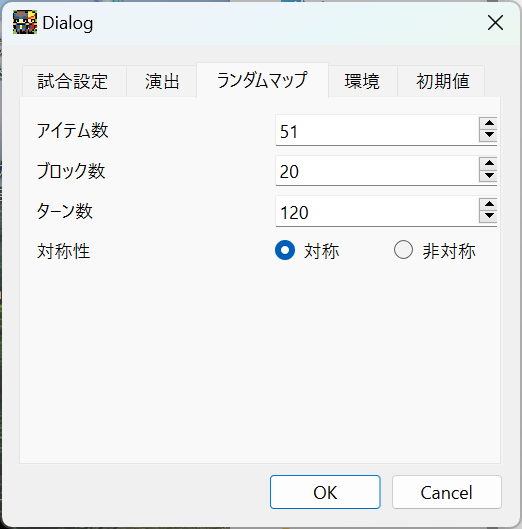
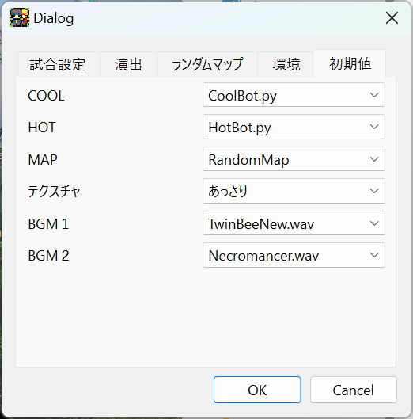

# U15-Server

[U15-プログラミンコンテスト一関大会](https://procon-ichinoseki.com/)用サーバーです。
[U-16旭川プログラミングコンテスト](http://www.procon-asahikawa.org/)で
使用されている[サーバー](https://github.com/u16procon/chaser-server/)をベースに一関大会用に変更しました。
ルールや通信仕様の詳細は公式サイトや同梱のdocファイル等を参照してください。

<div align="center">
  
</div>

## 主な変更点
* **先行・後攻を入れ替えた２対戦モード**
* **勝ち点・ポイントの表示**
* **Pythonプログラム起動機能**
* **コマンドライン引数**

 
## クライアント
このサーバーは通常のTCPで接続するクライントのほか、特殊なクライアントを起動することが可能です。

| | |
|-|-|
| **TCPユーザー** | 通常のクライアントです。クライアントとなるPCのAIにより動作します。
| **Python** | Pythonプログラムを起動します。Pythonコマンドが正しく設定されていないと表示されません。
| **ボットプログラム** | [2020年版のボットプログラム](https://www.procon-asahikawa.org/files/U16asahikawaBot.zip)が動作します。ボットプログラムが正しく設定されていないと表示されません。
| **CPU** | 特に何もしないモードです。主にデバッグ対戦用です。
| **マニュアル** | 別ウインドウでコントローラが開かれ、キャラクターを直接操作できます。

<div style="page-break-after: always;"></div>

## 環境構築
実行環境は以下の手順で構築できます。
1. ソースプログラムをコンマパイルして`U15-server.exe`を作成する
1. 適当なフォルダに`U15-server.exe`をコピーする
1. `windployqt U15-server.exe`で必要なライブラリをコピーする
1. 同じフォルダに`Bot`と`Music`をつくる
1. [ボットプログラム](https://www.procon-asahikawa.org/files/U16asahikawaBot.zip)をダウンロードして`Bot`フォルダにコピーする
1. `Music`フォルダに好きなBGMファイル(wavかmp3)をコピーする
1. `CHaser/lib`フォルダを作る
1. [`CHaser.py`](https://drive.google.com/uc?export=download&id=1KTKHUrz-BUxdzuRF9312sTTTkUZnZKFE)を`CHaser/lib`フォルダにコピーする
1. [`Template.py`](https://drive.google.com/uc?export=download&id=1QGO3kuJtxBJ1T0PKAMJaJKv3yzVLhcx_)を`CHaser`フォルダにコピーして、ファイル名を適当に変更する
1. Python環境が必要な時は[WinPython](https://github.com/winpython/winpython/releases/download/11.2.20241228final/Winpython64-3.12.8.0dot.exe)をダウンロードして、適当なフォルダに展開する
1. `U15-server.exe`を起動して、各種設定を環境に合わせて変更する
1. オリジナルのマップが欲しいときは`Map`フォルダを作成し、`U15-server`のマップエディタでマップを作成して保存する


## パッケージ
[設定済みパッケージ](https://drive.google.com/uc?export=download&id=1yIkhXQehAYvSiszFN9hWzQE52x33Crc4)をダウンロードして適当なフォルダに展開すれば、そのままで使用できます。PCに直接展開するほか、USBメモリなどに展開しても使用できるので、PCの環境を変えずに使用することができます。

### パッケージフォルダ構成
```
└── U15-Procon/
    ├── Server/
    │   ├── U15-server.exe
    │   ├── Bot/
    │   │   └── bot.exe
    │   └── Music/
    │       ├── TwinBeeNew.wav
    │       └── Necromancer.wav
    ├── CHaser/
    │   ├── CoolBot.py
    │   ├── HotBot.py
    │   ├── Template.py
    │   └── lib/
    │       └── CHaser.py
    ├── Map/
    │   └── Default.map
    ├── Logs
    └── WinPython/
        ├── python/
        │   └── python.exe
        └── vs code.exe
```

## プレイ手順
1. **クライアント**タイプを選択（CoolとHot）
1. Pythonプログラムの時は**プログラム**から実行プログラムファイルを選択
1. マップなどそのほかを設定
1. **スタンバイ**で対戦情報確定
1. **スタート**でゲーム開始
1. 先攻・後攻対戦の時は**スタンバイ**で先攻・後攻を入れ替え
1. **スタート**でゲーム開始
1. 繰り返し対戦の時は**再戦**でリセット

<div align="center">
  
</div>

<div style="page-break-after: always;"></div>

## 設定

### 試合設定
| | |
|-|-|
| **ゲーム進行速度** | ゲーム中のアニメーションの待ち時間です。初期設定は`150`[ms]（1000ms=1秒）です。
| **通信タイムアウト時間** | TCPクライアントにおけるレスポンスの待ち時間です。初期設定は`5000`[ms]（5秒）です。ルールに合わせて変更してください。
| **先攻・後攻入れ替え戦** | 先攻と後攻を入れ替えて２対戦行います。
| **繰り返し** | 繰り返し対戦を行います。

<div align="center">
  
</div>


### 演出
| | |
|-|-|
| **マップアニメ速度** | マップを表示する速度を設定です。初期設定は`150`[ms]です。
| **チームアニメ速度** | マップ上にキャラクターを初期表示する速度を設定です。初期設定は`150`[ms]です。
| **消音** | BGMのON/OFFが切り替えられます。チェックを付けるとBGMが再生されません。
| **ゲーム開始時に最大化** | 画面を最大化してスタートします。ゲーム途中でも`Ctrl-F`で切り替えできます。
| **視界フィルタ** | 視界外のマスにフィルタをかけて、視界を明確にします。
| **デモモード** | 自動で対戦を繰り返します。Pythonクライアントは対戦ごとにプログラムをランダムに変更します。
| **ボット対戦モード** | ボット対戦用モードです。スコアが残りターン数+アイテム数×3になります。

<div align="center">
  
</div>


### ランダムマップ
| | |
|-|-|
| **アイテム数** | 配置するアイテム数です。初期設定は `51` です。対称マップの時のアイテム数は奇数になるので、偶数を指定すると+1されます。
| **ブロック数** | 配置するブロック数です。初期設定は `20` です。
| **ターン数** | 対戦のターン数です。初期設定は `120` です。
| **対称性** | マップの対称性を指定します。初期値は `対称` です。

<div align="center">
  
</div>


### 環境
| | |
|-|-|
| **ログ保存場所** | ログを保存する場所です。初期設定は `../Logs` ですが、絶対パスに変えることを推奨します。
| **ボットコマンド** | ボット用コマンドです。初期設定は `./Bot/bot.exe` です。
| **Pythonコマンド** | pythonコマンドです。初期設定は `../WinPython/python/python.exe` ですが、環境によって変更してください。
| **プログラム場所** | pythonプログラムの場所です。初期設定は `../CHaser` です。
| **マップ場所** | マップファイルの保存場所です。初期設定は `../MAP` です。

<div align="center">
  
</div>


### 初期値
| | |
|-|-|
| **COOL** | Cool用Pythonプログラム 
| **HOT** | Hot用Pythonプログラム 
| **MAP** | マップファイルです。`RandamMap` を設定すると対戦ごとにランダムマップを生成します。
| **テクスチャ** | テクスチャタイプ（`ほうせき`,`あっさり`,`こってり`,`RPG`）
| **BGM1** | ラウンド１用BGMファイル
| **BGM2** | ラウンド２用BGMファイル

<div align="center">
  
</div>


## コマンドライン引数のリスト
各種設定を起動時にコマンドラインからオプションを指定できます。コマンドラインオプションが最優先されます。

| | |
|-|-|
| `-h`, `--help`                 | ヘルプメッセージを表示します
| `-r`, `--random`               | ランダムマップを生成します。
| `--cool` `<Program File>`      | Cool用Pythonプログラムファイルです。絶対パスか実行位置からの相対パスで指定してください。
| `--hot` `<Program File>`       | Hot用Pythonプログラムファイルです。絶対パスか実行位置からの相対パスで指定してください。
| `-m`, `--map` `<Map File>`     | マップファイルです。ファイル名のみ指定してください。
| `-t`,`--texture` `<テクスチャ>` | テクスチャタイプ（`ほうせき`,`あっさり`,`こってり`,`RPG`）
| `-b`,`--BGM` `<BGM File>`      | ラウンド１のBGMです。ファイル名のみ指定してください。
| `-b2`,`--BGM2` `<BGM File>`    | ラウンド２のBGMです。ファイル名のみ指定してください。


## 開発環境

このサーバーはC++とクロスプラットフォームライブラリQtによって開発されています。

### 開発環境(Qt6)
- Windows 11 24H2
- Qt Creator 15.0.1
- Desktop Qt 6.8.2 MinGW 64-bit

<!-- 
Mac環境は未テスト
### 開発環境(Qt5)
- MacOSX 10.11.3 ElCapitan
- Qt Creator 3.3.0
- Desktop Qt 5.4.2 clang 64bit
-->